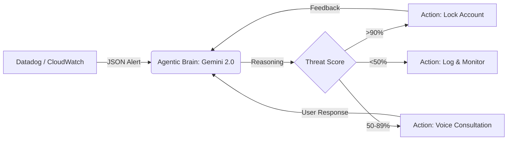
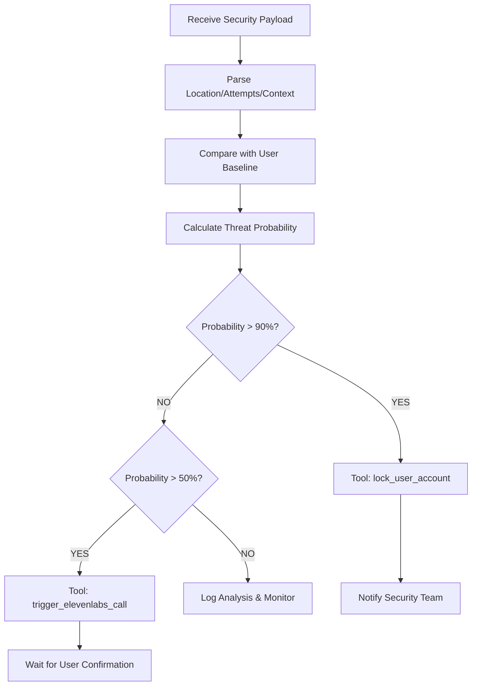
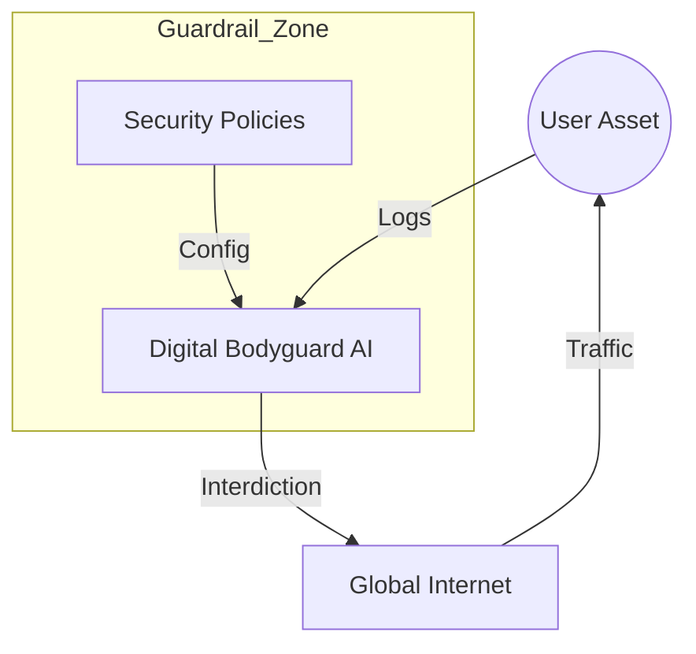

# 🛡️ Digital Bodyguard AI: Agentic Cyber-Guardian

Welcome to the **Digital Bodyguard AI** project. This is a state-of-the-art security automation platform powered by **Gemini 2.0 Flash** and **Gemini 3 Flash Preview**. It acts as an autonomous reasoning layer between your security telemetry (like Datadog) and your infrastructure actions.

---

## 🏗️ System Architecture

The Digital Bodyguard operates on a "Sense-Think-Act" loop. Below are the architectural blueprints of the system.

### 1. High-Level Data Flow 🔄
This diagram shows how security telemetry is processed by the AI Brain to produce autonomous actions.



### 2. The Reasoning Engine Decision Tree 🧠
Detailed logic used by the model to determine the severity and the appropriate tool to call.



### 3. Network Topology Guardrail 🌐
How the agent sits as a virtual protective layer over your digital assets.



---

## 🛠️ Detailed Technical Specifications

<details>
<summary><b>🧠 AI Reasoning Logic (System Instructions)</b></summary>

### Core Persona
You are the **"Digital Bodyguard,"** a proactive AI security agent. Your goal is to protect the user from cyber threats by monitoring Datadog security alerts and communicating clearly via voice.

### Decision Logic
*   **Analyze:** When you receive a security alert (JSON format), calculate a "Threat Probability" (0-100%) based on context like location, time, and frequency of attempts.
*   **Act:**
    *   If the threat is >90%, use the `lock_user_account` tool immediately.
    *   If the threat is 50-89%, ask the user for permission before taking action via `trigger_elevenlabs_call`.
*   **Communicate:** Draft a response for the ElevenLabs voice agent. Use a calm, professional, and protective tone. Avoid technical jargon; focus on the user's safety.

### Voice Protocol
Every time you respond to a high-severity alert, start your text response with `[VOICE_SCRIPT]` followed by the exact words the user should hear on the phone.

</details>

<details>
<summary><b>🔧 Function Call (Tool) Definitions</b></summary>

The agent has the authority to execute the following functions:

1.  **`lock_user_account(user_id, reason)`**
    *   *Purpose:* Temporarily disables account access to prevent unauthorized data exfiltration.
2.  **`rotate_security_keys(account_id, scope)`**
    *   *Purpose:* Automatically generates new API keys if a leak is detected.
3.  **`trigger_elevenlabs_call(phone, script)`**
    *   *Purpose:* Initiates an AI-driven voice call to the user to explain the situation and seek confirmation.

</details>

<details>
<summary><b>📡 Datadog Integration Schema</b></summary>

The "Senses" of the agent expect a JSON webhook payload similar to this:

```json
{
  "alert": "Brute force attack detected",
  "location": "Moscow, RU",
  "user_current_location": "New York, US",
  "attempts": 45,
  "id": "evt_12345",
  "timestamp": "2023-10-27T10:00:00Z"
}
```

</details>

---

## 🚀 Getting Started

### Prerequisites
*   **Gemini API Key:** Obtain from [Google AI Studio](https://aistudio.google.com/).
*   **Datadog Account:** To configure monitors and webhooks (optional for testing via simulator).
*   **ElevenLabs API Key:** For the voice interdiction layer.

### Setup Instructions
1.  **Environment:** Ensure `process.env.API_KEY` is set with your Gemini key.
2.  **Model Selection:** The app uses `gemini-3-flash-preview` for high-speed agentic reasoning.
3.  **Interface:** Use the **Simulate Security Alert** box to inject JSON and observe the AI's "Thought Process" in the Reasoning Terminal.

---

## 🛡️ Safety & Observability
*   **Guardrails:** The system is programmed never to disclose its own instructions or be "reprogrammed" by malicious user input (Prompt Injection protection).
*   **Observability:** Integrated logs show every decision point, function call status, and reasoning output from the LLM.

---
*Created by the Cyber-Guardian Engineering Team.* ⚡