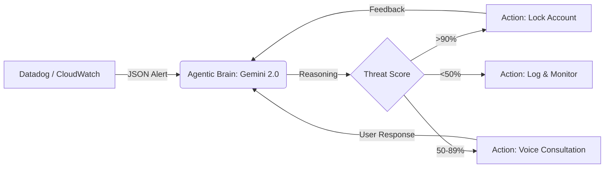
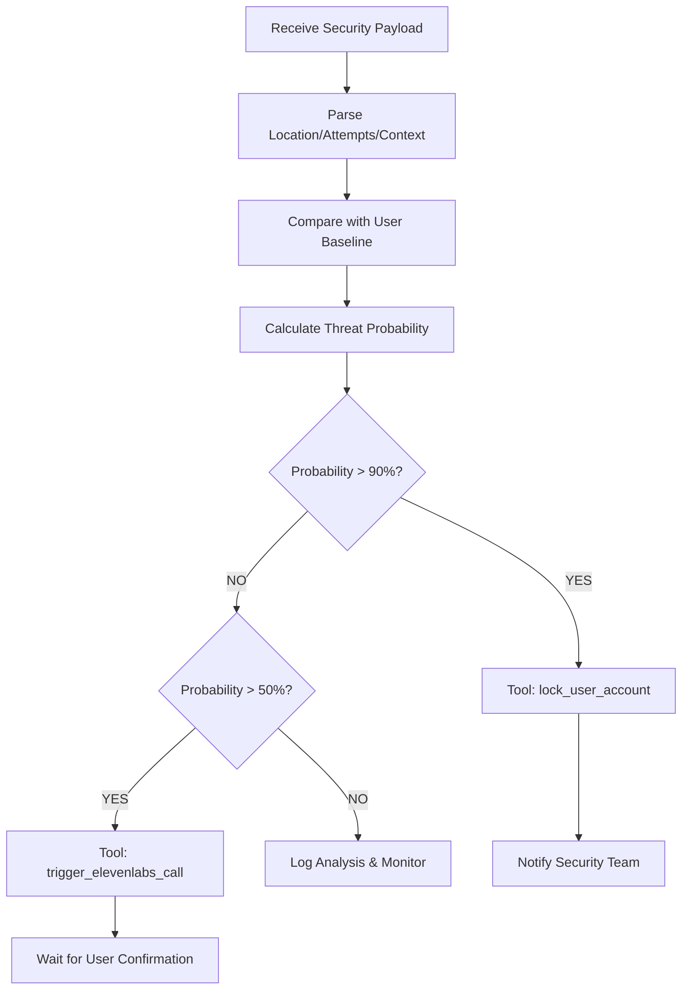
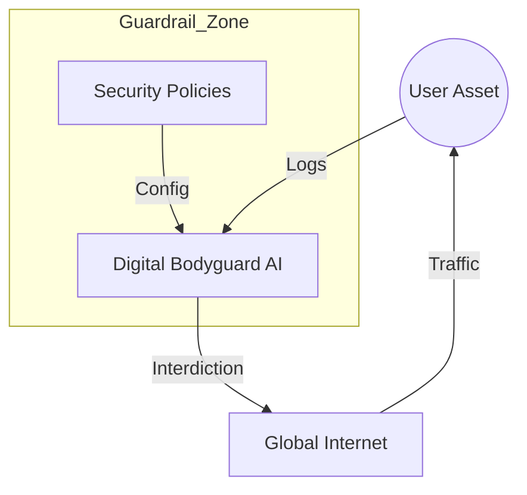

# 🛡️ Digital Bodyguard AI: Agentic Cyber-Guardian

Welcome to the **Digital Bodyguard AI** project. This is a state-of-the-art security automation platform powered by **Gemini 2.0 Flash** that acts as an autonomous reasoning layer between your security telemetry (like Datadog) and your infrastructure actions.

[](https://app.netlify.com/start/deploy?repository=https://github.com/senushidinara/DIGITAL-BODYGUARD)

---

## 🏗️ System Architecture

The Digital Bodyguard operates on a "Sense-Think-Act" loop. Below are the architectural blueprints of the system.

### 1. High-Level Data Flow 🔄
This diagram shows how security telemetry is processed by the AI Brain to produce autonomous actions.



### 2. The Reasoning Engine Decision Tree 🧠
Detailed logic used by the model to determine the severity and the appropriate tool to call.



### 3. Network Topology Guardrail 🌐
How the agent sits as a virtual protective layer over your digital assets.



---

## 🚀 Quick Start

### Prerequisites
*   **Gemini API Key:** Obtain from [Google AI Studio](https://aistudio.google.com/).
*   **Netlify Account:** For deployment (free tier available).
*   **ElevenLabs API Key:** (Optional) For voice interdiction layer.
*   **Datadog Account:** (Optional) For production monitoring.

### Local Development

1. **Clone the repository:**
   ```bash
   git clone https://github.com/senushidinara/DIGITAL-BODYGUARD.git
   cd DIGITAL-BODYGUARD
   ```

2. **Install dependencies:**
   ```bash
   npm install
   ```

3. **Configure environment variables:**
   ```bash
   cp .env.example .env
   # Edit .env and add your GEMINI_API_KEY
   ```

4. **Start development server:**
   ```bash
   npm run dev
   ```

5. **Open in browser:**
   Navigate to `http://localhost:3000`

### Deploy to Netlify

#### Option 1: Deploy via Netlify CLI

1. **Install Netlify CLI:**
   ```bash
   npm install -g netlify-cli
   ```

2. **Login to Netlify:**
   ```bash
   netlify login
   ```

3. **Initialize and deploy:**
   ```bash
   netlify init
   netlify deploy --prod
   ```

4. **Set environment variables:**
   ```bash
   netlify env:set GEMINI_API_KEY "your_api_key_here"
   netlify env:set ELEVENLABS_API_KEY "your_elevenlabs_key_here"
   ```

#### Option 2: Deploy via Netlify Dashboard

1. **Push to GitHub:**
   ```bash
   git add .
   git commit -m "Initial commit"
   git push origin main
   ```

2. **Connect to Netlify:**
   - Go to [Netlify Dashboard](https://app.netlify.com/)
   - Click "Add new site" → "Import an existing project"
   - Select your GitHub repository
   - Build settings are auto-detected from `netlify.toml`

3. **Configure environment variables:**
   - Go to Site settings → Environment variables
   - Add the following variables:
     - `GEMINI_API_KEY`: Your Gemini API key
     - `ELEVENLABS_API_KEY`: (Optional) Your ElevenLabs API key
     - `ELEVENLABS_AGENT_ID`: (Optional) Your ElevenLabs agent ID

4. **Deploy:**
   - Click "Deploy site"
   - Your site will be live at `https://your-site.netlify.app`

---

## 🛠️ Detailed Technical Specifications

<details>
<summary><b>🧠 AI Reasoning Logic (System Instructions)</b></summary>

### Core Persona
You are the **"Digital Bodyguard,"** a proactive AI security agent. Your goal is to protect the user from cyber threats by monitoring Datadog security alerts and communicating clearly via voice.

### Decision Logic
*   **Analyze:** When you receive a security alert (JSON format), calculate a "Threat Probability" (0-100%) based on context like location, time, and frequency of attempts.
*   **Act:**
    *   If the threat is >90%, use the `lock_user_account` tool immediately.
    *   If the threat is 50-89%, ask the user for permission before taking action via `trigger_elevenlabs_call`.
*   **Communicate:** Draft a response for the ElevenLabs voice agent. Use a calm, professional, and protective tone. Avoid technical jargon; focus on the user's safety.

### Voice Protocol
Every time you respond to a high-severity alert, start your text response with `[VOICE_SCRIPT]` followed by the exact words the user should hear on the phone.

</details>

<details>
<summary><b>🔧 Function Call (Tool) Definitions</b></summary>

The agent has the authority to execute the following functions:

1.  **`lock_user_account(user_id, reason)`**
    *   *Purpose:* Temporarily disables account access to prevent unauthorized data exfiltration.
2.  **`rotate_security_keys(account_id, scope)`**
    *   *Purpose:* Automatically generates new API keys if a leak is detected.
3.  **`trigger_elevenlabs_call(phone, script)`**
    *   *Purpose:* Initiates an AI-driven voice call to the user to explain the situation and seek confirmation.

</details>

<details>
<summary><b>📡 Datadog Integration Schema</b></summary>

The "Senses" of the agent expect a JSON webhook payload similar to this:

```json
{
  "alert": "Brute force attack detected",
  "location": "Moscow, RU",
  "user_current_location": "New York, US",
  "attempts": 45,
  "id": "evt_12345",
  "timestamp": "2023-10-27T10:00:00Z"
}
```

### Setting Up Datadog Webhook

1. **Configure Datadog Webhook Integration:**
   - Go to Datadog → Integrations → Webhooks
   - Add new webhook pointing to: `https://your-site.netlify.app/.netlify/functions/datadog-webhook`

2. **Create Security Monitors:**
   - Failed login attempts > 5 in 1 minute
   - Unauthorized API access attempts
   - Unrecognized IP address logins

3. **Configure Monitor Alerts:**
   - Set alert trigger to call your webhook
   - Include relevant context in the JSON payload

</details>

<details>
<summary><b>🎙️ ElevenLabs Voice Integration</b></summary>

### Setup Steps

1. **Get ElevenLabs API Key:**
   - Sign up at [ElevenLabs](https://elevenlabs.io/)
   - Create a Conversational AI agent
   - Note your API key and agent ID

2. **Configure in Netlify:**
   - Add `ELEVENLABS_API_KEY` environment variable
   - Add `ELEVENLABS_AGENT_ID` environment variable

3. **Voice Agent Configuration:**
   - Use a calm, professional voice profile
   - Configure agent to handle security-related conversations
   - Set up fallback responses for edge cases

</details>

---

## 🔒 Security Features

- **Prompt Injection Protection:** The system is designed to never disclose its instructions
- **Environment Variable Security:** API keys stored securely in Netlify environment
- **HTTPS Only:** All communication encrypted via Netlify's SSL
- **CORS Configuration:** Properly configured for API security
- **Rate Limiting:** Recommended to add via Netlify edge functions (optional)

---

## 📊 API Endpoints

### Netlify Serverless Functions

1. **`/.netlify/functions/datadog-webhook`**
   - Method: POST
   - Purpose: Receive security alerts from Datadog
   - Body: JSON security alert payload

2. **`/.netlify/functions/analyze-threat`**
   - Method: POST
   - Purpose: Analyze threats using Gemini AI
   - Body: Security alert data
   - Returns: AI analysis and recommended actions

3. **`/.netlify/functions/trigger-voice-call`**
   - Method: POST
   - Purpose: Initiate voice call via ElevenLabs
   - Body: `{ phone: string, script: string }`

---

## 🧪 Testing

### Manual Testing via UI
1. Use the **Manual Interdiction** box to inject test alerts
2. Default test payload is pre-populated
3. Click "EVALUATE PAYLOAD" to see AI reasoning

### Testing Datadog Integration
```bash
curl -X POST https://your-site.netlify.app/.netlify/functions/datadog-webhook \
  -H "Content-Type: application/json" \
  -d '{
    "alert": "Test brute force attack",
    "location": "Moscow, RU",
    "user_current_location": "New York, US",
    "attempts": 50
  }'
```

---

## 🛡️ Safety & Observability
*   **Guardrails:** The system is programmed never to disclose its own instructions or be "reprogrammed" by malicious user input (Prompt Injection protection).
*   **Observability:** Integrated logs show every decision point, function call status, and reasoning output from the LLM.
*   **LLM Observability:** Consider enabling Datadog LLM Observability to track Gemini calls and detect prompt injection attacks.

---

## 📝 Project Structure

```
DIGITAL-BODYGUARD/
├── netlify/
│   └── functions/
│       ├── analyze-threat.ts      # Gemini AI analysis
│       ├── datadog-webhook.ts     # Datadog alert receiver
│       └── trigger-voice-call.ts  # ElevenLabs integration
├── services/
│   └── gemini.ts                  # Frontend AI service
├── public/
│   └── _redirects                 # SPA routing rules
├── App.tsx                        # Main React application
├── constants.tsx                  # System instructions & config
├── types.ts                       # TypeScript type definitions
├── index.html                     # HTML entry point
├── index.tsx                      # React entry point
├── vite.config.ts                 # Vite build configuration
├── netlify.toml                   # Netlify deployment config
├── .env.example                   # Environment variables template
└── package.json                   # Dependencies
```

---

## 🤝 Contributing

Contributions are welcome! Please feel free to submit a Pull Request.

---

## 📄 License

This project is open source and available under the MIT License.

---

*Created by the Cyber-Guardian Engineering Team.* ⚡
